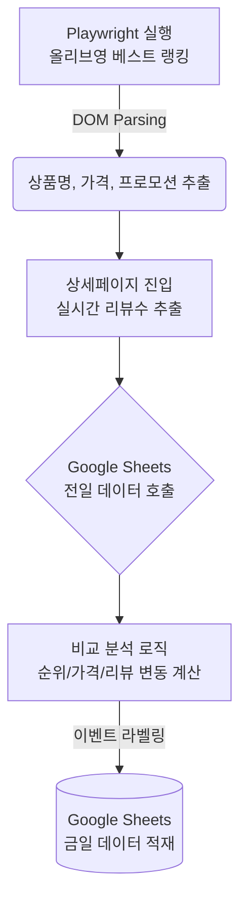

# 🌿 Olive Young Best Ranking Monitor (올리브영 랭킹 자동화 모니터링)

뷰티 카테고리 MD로서 매일 아침 수동으로 확인해야 했던 **H&B(올리브영) 실시간 트렌드 및 랭킹 변동을 자동화**하기 위해 직접 개발한 Python 기반 웹 크롤러 및 데이터 파이프라인입니다.

## 💡 Background & Objective
*   **문제 인식:** 매일 H&B 스토어의 인기 상품, 순위, 리뷰 증감률, 행사(1+1, 증정 등)를 수동으로 엑셀에 기록하며 많은 리소스 낭비 발생.
*   **해결 목표:** Python을 활용해 매일 지정된 시간에 데이터를 자동 수집하고, 전일 데이터와 비교 분석하여 유의미한 변동(이벤트)을 감지한 뒤 팀 대시보드(Google Sheets)에 자동 적재.

## 🚀 Key Features
1. **Stealth Crawling:** `playwright-stealth`를 적용하여 봇 탐지를 우회하고 올리브영 베스트 TOP 10 (종합/카테고리별) 데이터를 안정적으로 파싱.
2. **Review Data Extraction:** 랭킹 목록뿐만 아니라 각 상품의 상세 페이지로 진입하여 실시간 '리뷰 수'를 정밀하게 추출.
3. **Daily Data Comparison:** 전일 수집된 데이터(Google Sheets)를 호출하여 오늘의 데이터와 비교, 아래와 같은 인사이트를 자동 감지:
   * 🔺 순위 급상승 / 🔻 순위 하락
   * 💬 리뷰 급증 (단기간 내 리뷰 작성 트렌드 파악)
   * 💸 가격 인하 / 인상 (경쟁사 및 브랜드 가격 정책 감지)
   * 🎯 신규 프로모션 시작 / 종료 (1+1, 증정, 쿠폰 등)
4. **Automated Pipeline:** `gspread` 라이브러리를 통해 Google Sheets API와 연동, 전처리된 데이터를 팀원 모두가 실시간으로 볼 수 있는 클라우드 문서에 자동 적재.

## ⚙️ How it Works

## 🛠 Prerequisites
* `Python 3.9+`
* `playwright`, `playwright-stealth`
* `beautifulsoup4`
* `gspread`, `google-auth`

## 📂 Data Output Example
자동화 스크립트 실행 시, 구글 시트에 아래와 같은 형태로 전일 대비 변화 리포트가 적재됩니다.
> **1위** | ➡️ 유지 | **스킨1004** | 마다가스카르 센텔라 앰플 | +150개 | 🎯 신규 프로모션 (🎁 증정)
> **2위** | 🔺 +3   | **라운드랩** | 자작나무 수분 크림 | +85개  | -
> **3위** | 🆕 NEW  | **오브제** | 내추럴 커버 파운데이션 | -      | 🆕 신규 진입
